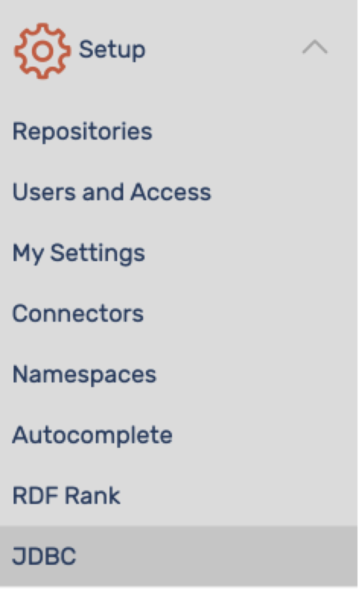
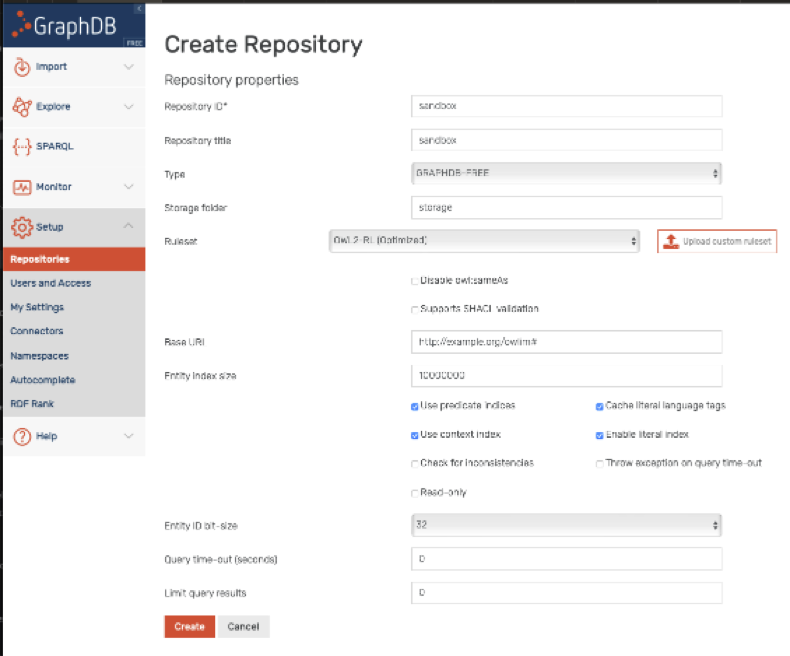
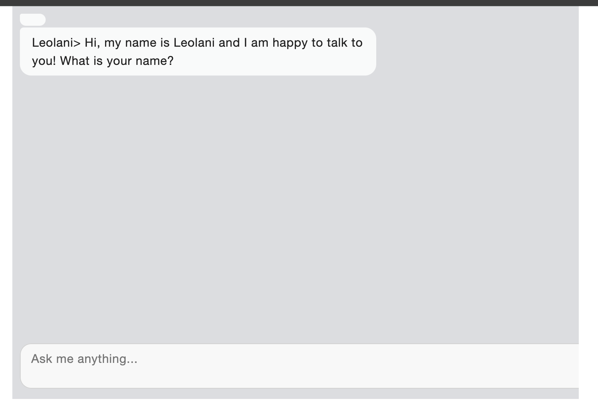

# Leolani conversational agent, Docker version

This repository contains the instructions and files to run the Docker version of a Leolani conversational agent.
You can chat with the conversational agent, which tries to interpret the interaction and store the interpretation
in a so-called episodic Knowledge Graph or eKG. It will process statements, opinions and claims and it will try to answer questions
by querying the eKG. It also reasons over the knowledge and the eKG. The reasoning may result in thoughts that is
expresses in the chat as statements, comments and questions.

The agent has been built from the Leolani [platform](https://github.com/leolani) and specififically using the repository: [cltl-text-to-ekg-app](https://github.com/leolani/cltl-text-to-ekg-app).
The docker image can be pulled from DockerHub: [piekvossen/leolani-text-to-ekg](https://hub.docker.com/repository/docker/piekvossen/leolani-text-to-ekg)

## Prerequisites
To be able to run the conversational agent you need to have Docker and GraphDB running on your local machine.
You also need to have sufficient memory to run the Docker image, which 8.73GB!

1. Download and install [Docker](https://www.docker.com/get-started/)
2. Download and install [GraphDB Free](https://graphdb.ontotext.com/)
3. Open GraphDB (opens as a localhost in your browser) and create a repository called ‘sandbox’:
   1. Click Setup → Repositories, see image:  
   2. Click Create new repository → GraphDB Free 
      1. Repository ID should be ```sandbox```
      2. Click on “Enable context index” 
      3. Set the Ruleset to: owl2RL (**Optimised**)
      4. Leave all other settings as they are and click ‘Create’ 
      6. For details, see the “Create Repository” screen dump: 
   3. The new repository should start running automatically. If it does not, go to the dropdown menu in the top right corner and select the repository. You can check whether it is running by viewing your repositories under Setup → Repositories. It should say ‘RUNNING’. 
   4. After creating the ‘sandbox’ you can turn the **Autocomplete** Index to true in the settings (check if it is connected to ‘sandbox’ and not some other database. This makes it easier to search using (sub)strings).
4. Download the following finetuned LLMs and place them in the resources folder of this repository. The link will get you to the university server. Pushing the Download button (at the top-right corner) will save the files as a ```tar``` file that you need to unpack: 
   1. [BERT-go-emotion](https://vu.data.surfsara.nl/index.php/s/VjHn1AHgizlzov6)
   2. [Multilingual-BERT-Conversational-triple-extraction](https://vu.data.surfsara.nl/index.php/s/xL9fPrqIq8bs6NH)
   3. [XLM-RoBERTa-DialogueAct-classification](https://vu.data.surfsara.nl/index.php/s/dw0YCJAVFM870DT)

## Running the conversational agent

* Make sure that GraphDB is running in the back with the “sandbox” repository
* Clone this repository somewhere on your disk 
* Place the donwloaded folders for the LLMs in the ```resources``` folder.
* Navigate in a terminal to the location of the decompressed download “leolani_text_to_ekg”. 
  * The content of the folder should look like:
    * config 
    * docker-compose.yml 
    * LICENSE
    * README.md 
    * storage 
    * resources 
    * clean_storage.sh
* Inside the folder in your terminal, enter the command:

    ```docker compose up```
  
This will pull the Leolani docker image specified in the “docker-compose.yml” file from the Docker Hub. 
It will take a while as the image is 8.73 GB in size(compressed). The first time you run it, this will take a while as there are several LLMs that need to be downloaded from the web into your local cache. Running the chatbot again does not require downloading the models and launching will be a lot faster.

If there are no error message in the terminal, you can open the chat interface in a browser:

* Open the following page: http://0.0.0.0:8000/chatui/static/chat.html (or http://localhost:8000/chatui/static/chat.html)

Once the scenario has started, this page will load the chat UI in which you can exchange messages. 
Wait until the browser page refreshes and the following page shows up with a 

* The chatbot will prompt you to give your name. Just give your name, like: “Joe” and not like “My name is Joe”. 
* When done conversing say ““goodbye” to close a session, which makes sure the interaction is saved. 
* To stop the Docker, enter the command “docker compose stop” from the same folder (e.g. by opening a separate TAB or terminal). 
* Alternatively, you can press CTRL-C several times in the terminal where it is running until the application is interrupted. WARNING!!!! Before you stop the docker container, first end the conversation by saying goodbye.

## Having a conversation
1. You can start chatting about whatever you like (but bear in mind that Leolani does not have the answer to everything)!
2. Leolani will formulate questions to you which are based on her thoughts. You can answer these questions as you like.
3. You can also ask questions to Leolani but she may not know the answer or understand your question.
4. You can always ask the question “Tell me all you know about me” or Tell me all you know about you” or about anybody else to get a dump of all she knows.
5. Finally note, if “llamalize” is set to True, response are sent to Llama3.2.1b, which is a small Llama model. You can instruct Llama to paraphrase the response but be aware that Llama may alter the response or not understand the instructions. If you want the pure responses from Leolani, open the “default.config” file from the “config” folder in a text editor and comment out: #llamalize=True. Note that you can also change the instructions, the temperature and length of the answer when using llamalize=True.
6. The processing and replying is slow so be patient and wait a little before you enter your next text.
7. It may happen that thoughts, questions, answers get mixed due to parallel processing of the input signals. This may be confusing.
8. Finally, the thoughts are sometimes abstract and surrealistic as her knowledge is limited.
9. The captured interaction is stored as data in the folder named ‘storage’ in the same folder as the docker configuration. One of the subfolders in storage is called “emissor”. This folder will contain a separate subfolder for each interaction, a so-called scenario. Six scenarios are shown in the figure below, all happening on the same day. In the case of the chatonly configuration, the scenario contains two json files and another subfolder “pdf” with the extracted triples. The structure of the storage is further explained in the lecture.
10. After you say “goodbye” or “bye” an interaction is closed. While the docker is running you can continue by saying “yes” again which will start a new scenario, asking again for you name. Note that in the robot version, the face recognition may recognise you again and you do not say your name.
